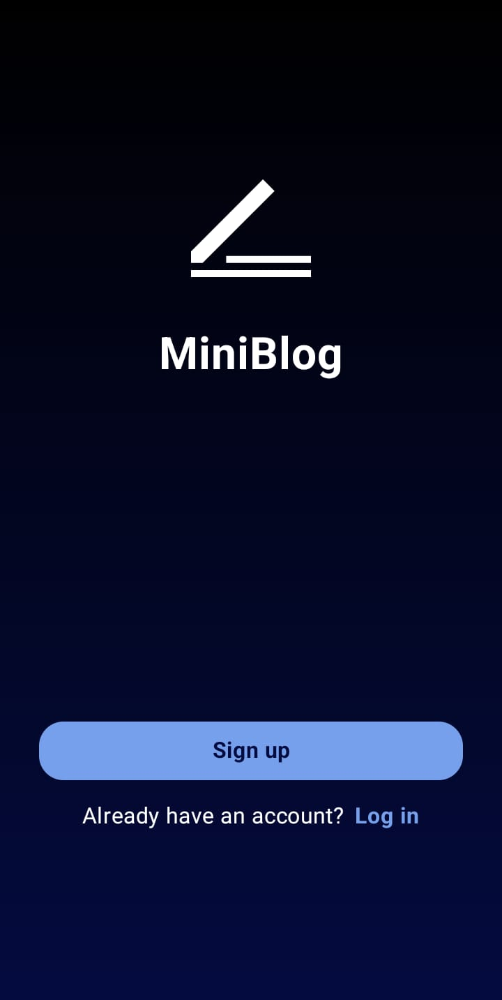
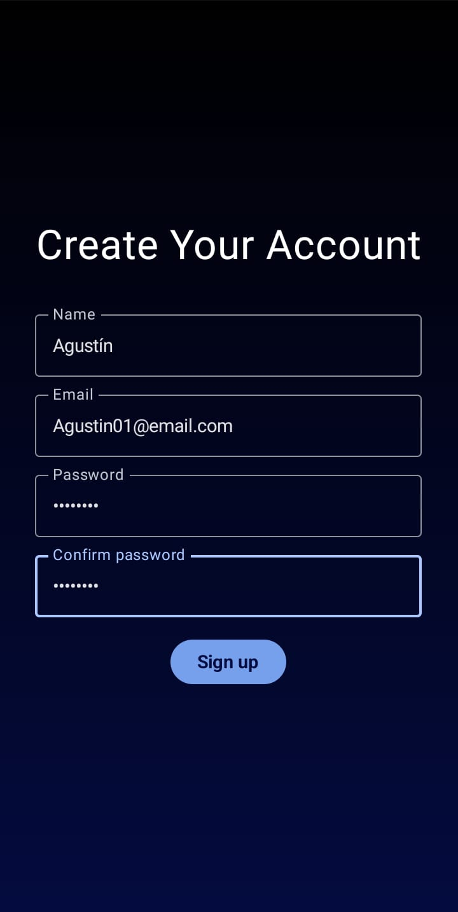
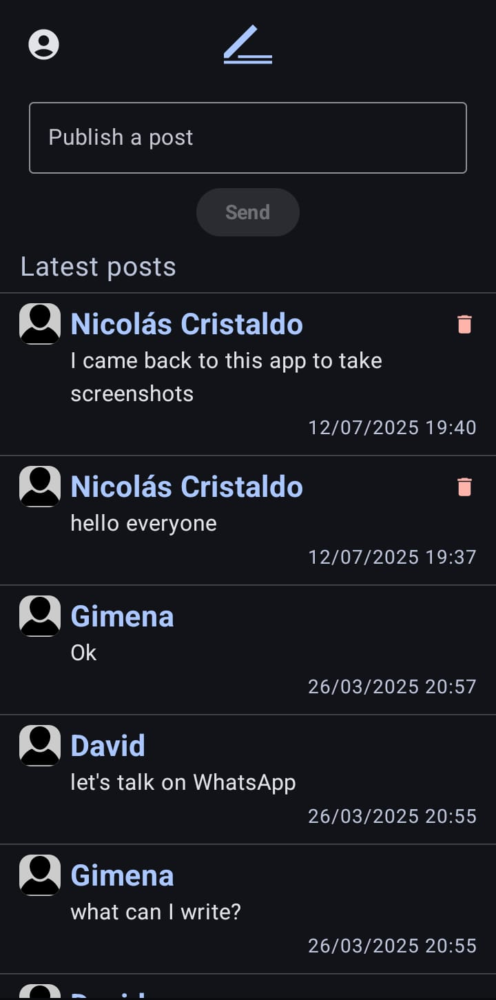
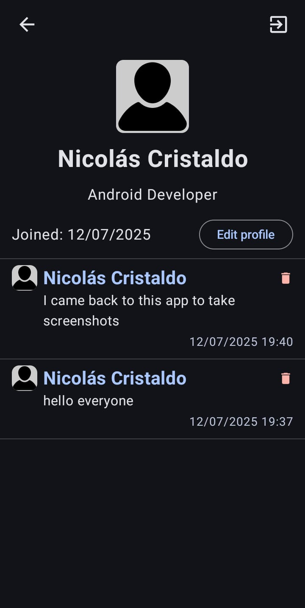

# 📝 MiniBlog

Android application built with **Jetpack Compose**, following the **MVVM architecture**, and using **Firebase** for authentication and data storage. The app allows users to register, log in, post messages, view other users' profiles, and manage their own account information.

## ✨ Features

- 📧 Sign up with email and password.
- 🔐 Log in securely using Firebase Authentication.
- 📝 Publish or delete your own posts.
- 👤 View your profile with posts, name, and description.
- ✏️ Edit your name and bio from your profile screen.
- 🔍 Explore other users’ profiles and their posts.
- ⬅️ Log out of your session easily.

## 📸 Screenshots

### 🔐 Initial Screen  
Choose to sign up or log in to your account.

---

### 📝 Sign Up  
Register with your name, email, and password.

---

### 🔑 Log In  
Access your account with your email and password.

---

### 🏠 Home 
Publish new posts and read the latest from other users.

---

### 👤 Profile Screen  
View and edit your own profile or visit others profiles.

---

## 🛠 Tech Stack

- **Kotlin** – Modern programming language for Android
- **Jetpack Compose** – Declarative UI framework
- **MVVM Architecture** – For clean and testable code
- **Kotlin Coroutines** – Asynchronous and concurrent programming
- **Hilt** – Dependency Injection framework
- **Firebase Authentication** – Email/password user authentication
- **Firebase Firestore** – Cloud NoSQL database to store posts and user profiles

## 📥 Download

You can download the APK from the releases section:

[Download APK](https://github.com/nicolasCristaldo/MiniBlog_android_compose/blob/main/app/release/MiniBlog.apk)

> **Note:** Make sure your device allows installation from unknown sources. After clicking the link, select the "Download" button to get the APK file.

---

Made by [Nicolás Cristaldo](https://github.com/nicolasCristaldo)
